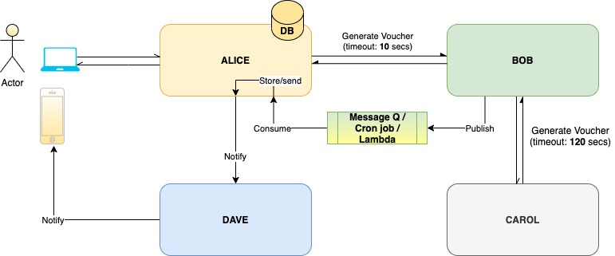

# vdc-assignment-v8.1

## System overview

## Project setup for ALICE
1/ `cd alice`
2/ Run `mvn spring-boot:run` to run the application

## Test data setup
1/ Open H2 console via browser. (http://localhost:8080/h2)
2/ url: jdbc:h2:file:./db/test_database 
3/ username: sa
4/ password:

## Supporting services (Swagger-ui)
